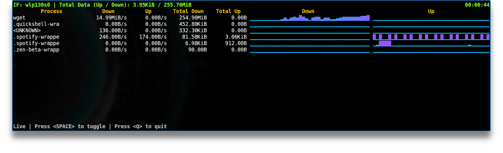

# nethugs



This is a CLI utility for displaying current network utilization by process with shiny graphs.

It's a fork and light modification of the excellent [bandwhich](https://github.com/imsnif/bandwhich) project.

## Table of contents

- [nethugs](#nethugs)
  - [Table of contents](#table-of-contents)
  - [How does it work?](#how-does-it-work)
  - [Installation](#installation)
    - [Downstream packaging status](#downstream-packaging-status)
    - [Download a prebuilt binary](#download-a-prebuilt-binary)
  - [Building from source](#building-from-source)
    - [Cross-compiling](#cross-compiling)
      - [Android](#android)
  - [Post install (Linux)](#post-install-linux)
    - [1. `setcap`](#1-setcap)
      - [Capabilities explained](#capabilities-explained)
    - [2. `sudo` (or alternative)](#2-sudo-or-alternative)
  - [Post install (Windows)](#post-install-windows)
  - [Usage](#usage)
  - [Contributing](#contributing)
  - [License](#license)

## How does it work?

`nethugs` sniffs a given network interface and records IP packet size, cross referencing it with the `/proc` filesystem on linux, `lsof` on macOS, or using WinApi on windows. It is responsive to the terminal window size, displaying less info if there is no room for it. It will also attempt to resolve ips to their host name in the background using reverse DNS on a best effort basis.

## Building from source

```sh
git clone https://github.com/j-chmielewski/nethugs.git
cd nethugs
cargo build --release
```

For the up-to-date minimum supported Rust version, please refer to the `rust-version` field in [Cargo.toml](Cargo.toml).

### Cross-compiling

Cross-compiling for alternate targets is supported via [cross](https://github.com/cross-rs/cross). Here's the rough procedure:

1. Check the target architecture. If on Linux, you can use `uname -m`.
2. Lookup [rustc platform support](https://doc.rust-lang.org/rustc/platform-support.html) for the corresponding target triple.
3. [Install `cross`](https://github.com/cross-rs/cross#installation).
4. Run `cross build --release --target <TARGET_TRIPLE>`.

#### Android

Until [cross-rs/cross#1222](https://github.com/cross-rs/cross/issues/1222) is solved, use the latest HEAD:

```sh
cargo install --git https://github.com/cross-rs/cross.git cross
cross build --release --target aarch64-linux-android
```

## Post install (Linux)

Since `nethugs` sniffs network packets, it requires elevated privileges.
On Linux, there are two main ways to accomplish this:

### 1. `setcap`

- Permanently allow the `nethugs` binary its required privileges (called "capabilities" in Linux).
- Do this if you want to give all unprivileged users full access to nethugs' monitoring capabilities.
    - This is the **recommended** setup **for single user machines**, or **if all users are trusted**.
    - This is **not recommended** if you want to **ensure users cannot see others' traffic**.

```sh
# assign capabilities
sudo setcap cap_sys_ptrace,cap_dac_read_search,cap_net_raw,cap_net_admin+ep $(command -v nethugs)
# run as unprivileged user
nethugs
```

#### Capabilities explained
- `cap_sys_ptrace,cap_dac_read_search`: allow access to `/proc/<pid>/fd/`, so that `nethugs` can determine which open port belongs to which process.
- `cap_net_raw,cap_net_admin`: allow capturing packets on your system.

### 2. `sudo` (or alternative)

- Require privilege escalation every time.
- Do this if you are an administrator of a multi-user environment.

```sh
sudo nethugs
```

Note that if your installation method installed `nethugs` to somewhere in
your home directory (you can check with `command -v nethugs`), you may get a
`command not found` error. This is because in many distributions, `sudo` by
default does not keep your user's `$PATH` for safety concerns.

To overcome this, you can do any one of the following:
1. [make `sudo` preserve your `$PATH` environment variable](https://unix.stackexchange.com/q/83191/375550);
2. explicitly set `$PATH` while running `nethugs`: `sudo env "PATH=$PATH" nethugs`;
3. pass the full path to `sudo`: `sudo $(command -v nethugs)`.

## Post install (Windows)

You might need to first install [npcap](https://npcap.com/#download) for capturing packets on Windows.

## Usage

```
Usage: nethugs [OPTIONS]

Options:
  -i, --interface <INTERFACE>      The network interface to listen on, eg. eth0
  -r, --raw                        Machine friendlier output
  -n, --no-resolve                 Do not attempt to resolve IPs to their hostnames
  -s, --show-dns                   Show DNS queries
  -d, --dns-server <DNS_SERVER>    A dns server ip to use instead of the system default
      --log-to <LOG_TO>            Enable debug logging to a file
  -v, --verbose...                 Increase logging verbosity
  -q, --quiet...                   Decrease logging verbosity
  -p, --processes                  Show processes table only
  -c, --connections                Show connections table only
  -a, --addresses                  Show remote addresses table only
  -u, --unit-family <UNIT_FAMILY>  Choose a specific family of units [default: bin-bytes] [possible values: bin-bytes, bin-bits, si-bytes, si-bits]
  -t, --total-utilization          Show total (cumulative) usages
  -h, --help                       Print help (see more with '--help')
  -V, --version                    Print version
```

## Contributing

See [CONTRIBUTING.md](CONTRIBUTING.md).

## License

MIT
